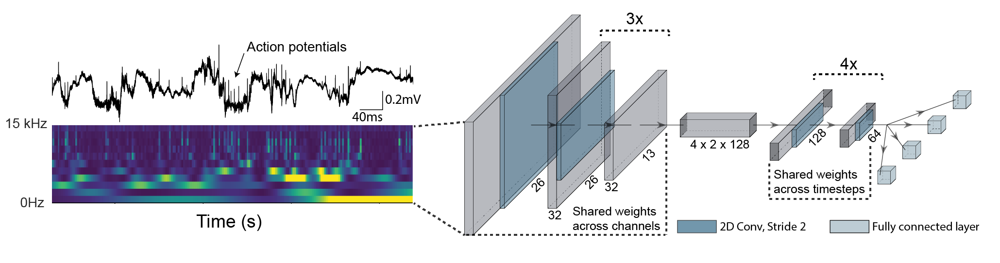
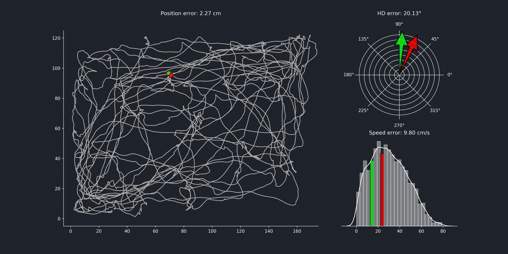

[](https://github.com/CYHSM/DeepInsight/blob/master/LICENSE.md)


## DeepInsight: A general framework for interpreting wide-band neural activity

DeepInsight is a toolbox for the analysis and interpretation of wide-band neural activity and can be applied on unsorted neural data. This means the traditional step of spike-sorting can be omitted and the raw data can be used directly as input, providing a more objective way of measuring decoding performance. 


## Example Usage with Google Colaboratory

We created a Colab notebook to showcase how to analyse your own two-photon calcium imaging data. We provide the raw as well as the preprocessed dataset as downloads if you just want to train the model. You can replace the code which loads the traces with your own data handling and directly train it to decode your behaviour or stimuli in the browser. 

[](https://colab.research.google.com/drive/11RXK7JIgVM8Zy9M7xEtt1k62i3JXbZLU)  


## Example Usage with python script
```python
import deepinsight

# Load your electrophysiological or calcium-imaging data
(raw_data,
 raw_timestamps,
 output,
 output_timestamps,
 info) = deepinsight.util.tetrode.read_tetrode_data(fp_raw_file)

# Transform raw data to frequency domain
deepinsight.preprocess.preprocess_input(fp_deepinsight, raw_data, sampling_rate=info['sampling_rate'],
                                        channels=info['channels'])

# Prepare outputs
deepinsight.util.tetrode.preprocess_output(fp_deepinsight, raw_timestamps, output, output_timestamps,
                                           sampling_rate=info['sampling_rate'])

# Train the model
deepinsight.train.run_from_path(fp_deepinsight, loss_functions, loss_weights)

# Get loss and shuffled loss for influence plot
losses, output_predictions, indices = deepinsight.analyse.get_model_loss(fp_deepinsight, stepsize=10)
shuffled_losses = deepinsight.analyse.get_shuffled_model_loss(fp_deepinsight, axis=1, stepsize=10)

# Plot influence across behaviours
deepinsight.visualize.plot_residuals(fp_deepinsight, frequency_spacing=2)
```

See also the [jupyter notebook](notebooks/deepinsight_example_usage.ipynb) for a full example for decoding behaviours from tetrode CA1 recordings. 

Following Video shows the performance of the model trained on position (left), head direction (top right) and speed (bottom right):


## Installation
For now install DeepInsight with the following command:
```
pip install -e git+https://github.com/CYHSM/DeepInsight.git#egg=DeepInsight
```
If you prefer to use DeepInsight from within your browser, we provide Colab-Notebooks to guide you through how to use DeepInsight with your own data. 

- How to use DeepInsight with two-photon calcium imaging data [](https://colab.research.google.com/drive/11RXK7JIgVM8Zy9M7xEtt1k62i3JXbZLU)

- How to use DeepInsight with electrophysiology data [](https://colab.research.google.com/drive/1h3RYr3r0Zs2k6I53bTiYRq_6VQo38iMP)